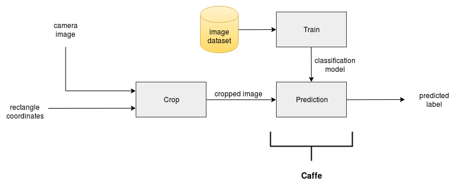
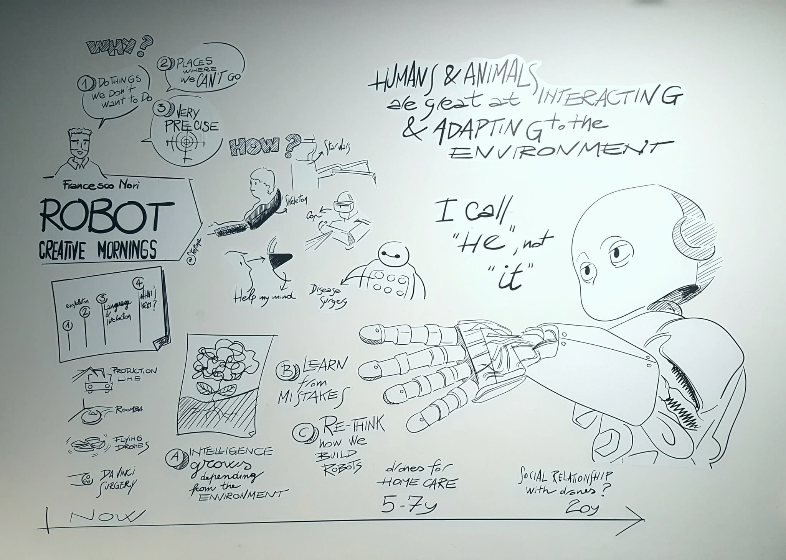

# VVV18 ORANGE TEAM

- 📚 [**Project description**](https://github.com/vvv-school/vvv18/wiki/Team-contest)
- 👋 [**Meet the team**](https://github.com/orgs/vvv-school/teams/vvv18-team-orange/members)
- :feet: [**Project management**](https://github.com/vvv-school/vvv18-demo-team-orange/projects/1)
- 🗣 [**Issues**](https://github.com/vvv-school/vvv18-demo-team-orange/issues)

# Documentation

Ciao a tutti and welcome to the official documentation of the **VVV18 Orange Team** repository for the final project of this amazing school!

Let's start with a brief overview of the problem itself and then move on how we decided to tackle it.

## Table of Contents  
- [Overview](#overview)  
- [Input (speech commands)](#input)
- [Vision](#vision) 
- [Classification (Deep Learning)](#classification) 
- [Kinematics](#kinematics)
- [Dynamics](#dynamics)
- [Dependencies](#dependencies)
- [Installation](#installation)
- [Acknowledgments](#ack) 


<a name="overview"/>

## Overview

We were asked to make iCub able to:
 - look at two objects shown by the human in front of him;
 - classify them correctly and point at the one asked by the human;
 - wait for an acknowledgement from the human to understand if he succeeded or not and behave consequently, showing happiness or sadness.

The approach we decided to follow has been inspired by the YARP modularity, leading us to a State-Machine architecture.


The central role is played by a **Manager application**, which is in charge of communicating with the other modules using the RPC protocol. The type of information exchanged can either be data (for instance, the 3D position of the object to point at) or triggering signals (just to make a module run). The Manager is also, of course, in charge of defining the temporal sequence of actions, waiting for an ACK after each operation. The temporal sequence is the sequent:


The other modules are divided in accordance with the subdivision of topics followed during the school and provide the functionalities needed from the Manager to perform the demo task. The only exception to this is the Kinematics module which also includes the Gaze control, in order to avoid  having modules with just one function or composed by only a few lines of code. This choice is also supported by the YARP implementation of the Cartesian and Gaze interfaces, which share the same basic idea of control and implementation.
Let's have a look at the details of each module:

<a name="input"/>

### Input (Speech commands)
The input command is given through speech. We use the speechRecognizer module of the *robotology* repository, which allows us to extract keywords from voice sentences. We map the following vocal commands in relative keywords, sent through RPC to the manager module:

|          Sentence         |   rpc command   |             Description             |
|          ---              |        ---      |                 ---                 |
| "return to home position" |       home      | move the robot to the home position |
|  "where is the OBJ_NAME"  |    where + obj  |  search for the OBJ_NAME            |
|       "see you soon"      |       quit      |           close the program         |

where OBJ_NAME can be one of the sequent:

- box
- car
- toy
- mug
- book

Once the user speaks, the sentence is translated in the basic RPC command, where each option triggers a certain behavior.

<a name="vision"/>

### Vision
The Vision module performs the image acquisition and processing needed to obtain information from the robot's cameras about the physical world with which it interacts. In particular, it is used to locate objects placed on the table in front of it and to obtain their exact position with respect to it's own body coordinates.


This component makes use of two YARP modules: lbpExtractor and SFM. The former acquires the left robot camera and performs texture filtering and object segmentation, outputting the bounding boxes coordinates of the detected blobs. These are used by the vision module to compute, for each of them, their center point in (x,y) image coordinates. Subsequently, SFM collects both the left and right robot camera images, computes the disparity map and uses it, together with the an (x,y) image coordinate point, to compute the (x,y,z) world coordinate of the latter with reference to the robot's torso. Finally, the vision module returns to the manager the list of bounding boxes and their centers in world coordinates.

<a name="classification"/>

### Classification (Deep Learning)

The classification component uses a Caffe machine learning module trained with a subset of the standard dataset that we used during the winter school courses. The latter has been trained offline with 5 categories of objects (box, car, toy, mug, book), generating a model that is used in the online object recognition. This is performed as follows: this module receives a bounding box from the Manager, retrieves the image from the left camera of the robot and crops it accordingly, then uses the generated image as a testing example on the machine learning system. The predicted label is, subsequently, sent back in response to the Manager. The Manager will request this computation for each of the bounding boxes retrieved from the Vision module.



<a name="kinematics"/>

### Kinematics
In the Kinematics lecture we programmed iCub to reach a position in the cartesian space with its hand, in accordance to a reference frame positioned into its palm. In particular, a point in the world was obtained from the triangulation of two points in each of the robot's cameras. In this case, we are not interested in reaching a point, but in pointing at it using the index finger, which represents now the new end-effector frame we want to control. To accompilsh this, we made use of the Actions Rendering Engine (ARE), a module combining multiple libraries and modules from the iCub repository that allows the execution of both basic and complex actions. A fast test of this module starts by connecting it:

`$ yarp rpc /actionsRenderingEngine/cmd:io`

To ask iCub to point to a far point, we use the function *pfar(...)*, which takes in input the three (x,y,z) coordinates of the point, defined in the global frame of iCub:

`$ pfar (-1.0 0.0 0.0)`

iCub will point to the coordinates with the index and will also look to the specified point. Then it will come back to the home position and return an acknowledgment.


This functionality is performed thanks to the use of an `RpcCLient` port:

`RpcClient rpcPortARE;`

To send the command, we use a vocab instead of a string: 

```
Bottle cmdARE;
cmdARE.addVocab(Vocab::encode("pfar"));
```

Finally, the point coordinates are added through a list:

```
Bottle &tmpList=cmdARE.addList();
tmpList.addDouble(-1.0);
tmpList.addDouble(0.0);
tmpList.addDouble(0.0);
```

Once the bottle is sent to the ARE module, the latter replies with a vocab [ack]/[nack] and we check the answer comparing the vocabs: 

```
Bottle replyARE
rpcPortARE.write(cmdARE,replyARE);
replyARE.get(0).asVocab()==Vocab::encode("ack");
```

<a name="dynamics"/>

### Dynamics
As we learnt from the *Robot Dynamics* lecture, iCub is equipped with sensors able to perceive generalized forces applied to the end effector. This has been exploited starting from the consideration that having the robot hand in *high five* or *low five* position means that our end-effector frame has the axes almost collinear with the root frame (even if the frames are somehow rotated). This means that, once we established the gestures we intend to use to confirm/reject the classification, we just need to read the force applied along the axis of interest to discriminate the two cases. For instance, in the high-five configuration the axis of interest is the *x_root*; while in the low-five configuration we'll be interested in the *z_root* component. The magnitude of the force, if higher than a certain threshold, will tell us that a contact happened; the direction of the force will tell us if it's a positive or negative ack.
The following scheme summirize the sensing of a High-5 from iCub: 


In which Fx is the projection of the vector F on the x axis.

To do all of this, it is mandatory to reset the sensor once we reach the high/low five hand configuration with the kinematic control. In this way, we will read always 0 (more or less) and a higher value only in case of contact! Useful instructions to test the module are:

`$ yarp rpc /wholeBodyDynamics/rpc:i`

to reset the sensor to 0, giving this value as input to the rpc port:

`$ yarp read ... /wholeBodyDynamics/right_arm/cartesianEndEffectorWrench:o`

to read forces and wrenches perceived by the sensor and projected to the end-effector:

`$ yarpscope --remote "/wholeBodyDynamics/right_arm/cartesianEndEffectorWrench:o`

to open a yarp scope and link it to the sensor readings, in order to understand the direction of the applied forces and to tune the threshold to detect the contact.

<a name="dependencies"/>

## Dependencies
- [robotology/segmentation](https://github.com/robotology/segmentation)
- [robotology/stereo-vision](https://github.com/robotology/stereo-vision)

<a name="installation"/>

## Installation
To install this demo, simply make and install as follows:

```
$ git clone https://github.com/vvv-school/vvv18-demo-team-orange.git
$ cd vvv18-demo-team-orange
$ mkdir build
$ cd build
$ cmake ..
$ make install
```

Be sure that the LUA directory points to the path of the project.

If you do not wish to install all the software but just a subset of selected modules, you can choose not to build the entire repository but just one of its components. Simply navigate to one of the subfolders of `/src` and follow these steps:

```
$ git clone https://github.com/vvv-school/vvv18-demo-team-orange.git
$ cd vvv18-demo-team-orange/src/<module_of_choice>
$ mkdir build
$ cd build
$ cmake ..
$ make install
```
<a name="ack"/>

## Acknowledgements
First and foremost, the Orange Team thanks from the deep of its yarpserver the teachers **Ugo Pattacini** and **Vadim Tikhanoff** for the patience and the help of these two last days.

Another deep thanks goes to **the organizers, the teachers (assistants included), the invited speakers** and everyone else that helped making this school so great,

Farewell!



