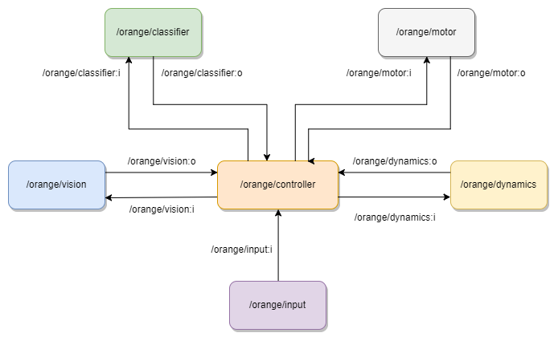
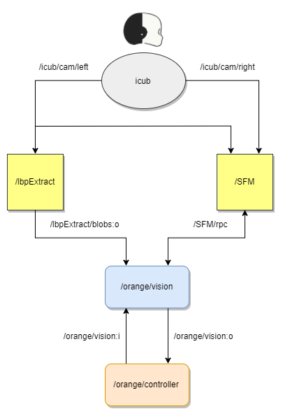

# VVV18 ORANGE TEAM

- 📚 [**Project description**](https://github.com/vvv-school/vvv18/wiki/Team-contest)
- 👋 [**Meet the team**](https://github.com/orgs/vvv-school/teams/vvv18-team-orange/members)
- :feet: [**Project management**](https://github.com/vvv-school/vvv18-demo-team-orange/projects/1)
- 🗣 [**Issues**](https://github.com/vvv-school/vvv18-demo-team-orange/issues)

# Documentation

Ciao a tutti and welcome to the official documentation of the **VVV18 Orange Team** repository for the final project of this amazing school!

Let's start with a brief overview of the problem itself and then move on how we decided to tackle it.

## Overview

We were asked to make iCub able to:
 - look at two objects shown by the human in front of him;
 - classify them correctly and point at the one asked by the human;
 - wait for an acknowledgement from the human to understand if he succeeded or not and behave consequently, showing happiness or sadness.

The approach we decided to follow has been inspired by the YARP modularity, leading us to a State-Machine architecture. 

The central role is played by a **manager application**, which is in charge of communicating with the modules available using a rpc protocol. The information exchanged can be both data (for instance, the 3D position of the object to point at) and triggering signals (just to make a module run). The manager is also, of course, in charge of defining the temporal sequence of actions, waiting for an ack after each single operation. The temporal sequence can be defined as follows:

The other modules are divided according with the topics subdivision followed during the school and provide the function implementations needed from the manager to carry out the demo. Only the Kinematics module includes also the Gaze control, in order to avoid "empty modules" (modules which just one function or few lines of code inside). This finds support also in the YARP implementation of the two interfaces, which share the same basic idea of control and implementation. Let's have a look at each module in details:

### Vision
The vision module performs the image acquisition and processing needed to obtain information from the robot's cameras about the physical world with which it interacts. In particular, it is used to locate objects placed on the table in front of it and to obtain their exact position with respect to it's own body coordinates.

This component makes use of two YARP modules: lbpExtractor and SFM. The former acquires the left robot camera and performs texture filtering and object segmentation, outputting the bounding boxes coordinates of the detected blobs. These are used by the vision module to compute, for each of them, their center point in (x,y) image coordinates. Subsequently, SFM collects both the left and right robot camera images, computes the disparity map and uses it, together with the an (x,y) image coordinate point, to compute the (x,y,z) world coordinate of the latter with reference to the robot's torso. Finally, the vision module returns to the manager the list of bounding boxes and their centers in world coordinates.

### Classification (Deep Learning)

### Kinematics
In the kinematics lectur we programmed iCub to reach a position in the cartesian space with his hand. In particular, the point was retrieved from the triangulation of two points from images of both iCub cameras and the reference frame of the hand was positioned into the palm. In this case, we are not interested in reaching a point, but in pointing at it using the index finger, which represents now the new end-effector frame we want to control. We found out that this functionality is already implemented in the Actions Rendering Engine (ARE) module, a module combining multiple libraries and modules from the iCub repository that allows to execute both basic and complex actions. A fast test of this module starts by connecting it:

- `$ yarp rpc /actionsRenderingEngine/cmd:io`

To ask iCub to point to a far point, we use the function *pfar(...)*, which takes in input the three coordinates of the point, defined in the global frame of iCub:

- `$ pfar (-1.0 0.0 0.0)`

iCub will point to the coordinates with the index and will also look to the specified point (!). Then he will come back to the home position and return an acknowledgment.

When developing the module, we have to connect to the right port using a `RpcCLient` port:

`RpcClient rpcPortARE;`

Then to send the command pfar, we need to use a vocab instead of a string: 

`Bottle cmdARE;`
`cmdARE.addVocab(Vocab::encode("pfar"));`

And finally we add the point coordinates usind a list:

`Bottle &tmpList=cmdARE.addList();
tmpList.addDouble(-1.0);
tmpList.addDouble(0.0);
tmpList.addDouble(0.0);`

Once we send the bottle to the ARE module, it replies with a vocab [ack]/[nack] and we check the answer comparing the vocabs: 

`Bottle replyARE
rpcPortARE.write(cmdARE,replyARE);
replyARE.get(0).asVocab()==Vocab::encode("ack");`

### Dynamics
As we learnt from the *Robot Dynamics* lecture, iCub mounts on the body sensors able to perceive generalized forces applied to the end effector. This has been exploited starting from the consideration that having the robot hand in *high five* or *low five* position means that our end-effector frame has the axes almost collinear with the root frame (even if the frames are somehow rotated). This means that, once we established the gestures we intend to use to confirm/reject the classification, we just need to read the force applied along the axis of interest to discriminate the two cases. For instance, in the high-five configuration the axis of interest is the *x_root*; while in the low-five configuration we'll be interested in the *z_root* component. The magnitude of the force, if higher than a certain threshold, will tell us that a contact happened; the direction of the force will tell us if it's a positive or negative ack.
The following scheme summirize the sensing of a High-5 from iCub: 

In which Fx is the projection of the vector F on the x axis.

To do all of this, it is mandatory to reset the sensor once we reach the high/low five hand configuration with the kinematic control. In this way, we will read always 0 (more or less) and a higher value only in case of contact! Useful instructions to test the module are:

- `$ yarp rpc /wholeBodyDynamics/rpc:i`

to reset the sensor to 0, giving this value as input to the rpc port;

- `$ yarp read ... /wholeBodyDynamics/right_arm/cartesianEndEffectorWrench:o`

to read forces and wrenches perceived by the sensor and projected to the end-effector;

- `$ yarpscope --remote "/wholeBodyDynamics/right_arm/cartesianEndEffectorWrench:o`

to open a yarp scope and link it to the sensor readings, in order to understand the direction of the applied forces and to tune the threshold to detect the contact.

#### Dependencies
- [robotology/segmentation](https://github.com/robotology/segmentation)
- [robotology/stereo-vision](https://github.com/robotology/stereo-vision)

